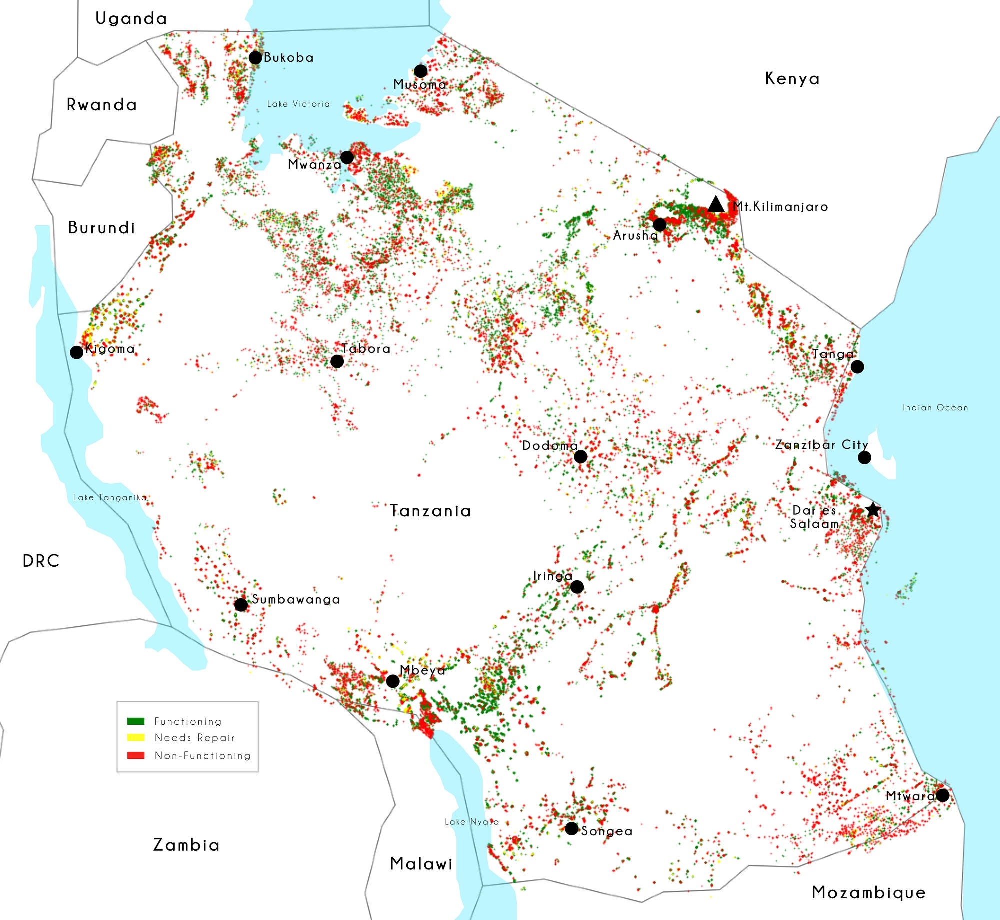
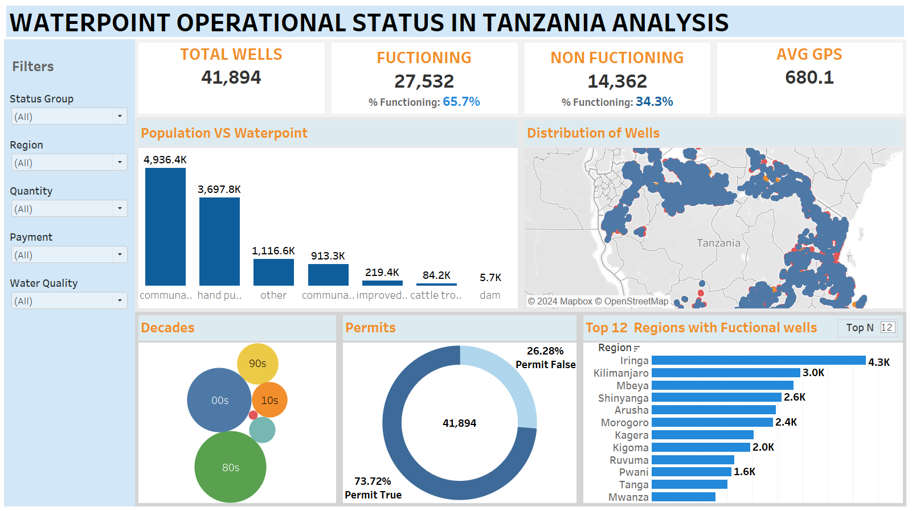

# Predictive Analytics for Waterpoint Operational Status in Tanzania

Tanzania relies heavily on waterpoints to provide clean and accessible water to its population. However, many waterpoints are either non-functional or in need of repair, leading to inefficiencies and hardships for communities that depend on them. This project seeks to address this issue by building a machine learning model to predict the operational status of waterpoints, enabling better resource allocation and proactive maintenance.
## Table of Contents
1. [Overview](#overview)
2. [Business Understanding](#business-understanding)
   - [Objectives](#objectives)
   - [Stakeholders](#stakeholders)
   - [Success Criteria](#success-criteria)
   - [Key Questions](#key-questions)
   - [Constraints](#constraints)
   - [Potential Impact](#potential-impact)
3. [Data Understanding](#data-understanding)
   - [Dataset](#dataset)
   - [Data Details](#data-details)
4. [Workflow](#workflow)
   - [Business Understanding Step](#business-understanding-step)
   - [Data Understanding Step](#data-understanding-step)
   - [Data Preparation](#data-preparation)
   - [Modeling](#modeling)
   - [Evaluation](#evaluation)
5. [Rationale](#rationale)
6. [Results](#results)
7. [Limitations](#limitations)
8. [Recommendations](#recommendations)
9. [Tableau Dashboard](#tableau-dashboard)

---

## Overview
This project aims to predict the operational status of waterpoints in Tanzania using machine learning techniques. It addresses critical challenges in water resource management by identifying whether a waterpoint is functional, needs repair, or is non-functional, enabling better planning and allocation of resources.

---

## Business Understanding
### Objectives
The primary goal of this project is to predict the operational status of waterpoint in Tanzania. By accurately predicting whether it is fuctional, needs repair or is non-fuctional, it can help the Tanzania Ministry of water and other stakeholders in optimizing operations ansd ensure a reliable supply of clean water to communities.
### Stakeholders
- **Tanzania Ministry of Water:** Responsible for infrastructure and resource allocation.
- **Local Communities:** Rely on waterpoints for daily needs.
- **Maintenance Teams:** Tasked with repairs and operational upkeep.

### Success Criteria
- **Accuracy:** The model should have a high accuracy in predicting the status of waterpoints.
- **Actionable Insight:** The predictions should lead to actionable insight that can improve maintainance schedules and resouce allocation
- **Scalability:** The solution should be scalable to handle data from other regions or countries

### Key Questions
- Which factors most influence the operational status of waterpoints?
- How can we prioritize waterpoints for maintenance based on the model’s predictions?
- What patterns or trends can be identified from the data that could inform future waterpoint installations?

### Constraints
- **Data Quality**: The accuracy of the model depends on the quality and completeness of the
data.
- **Resource Limitations:** Limited resources for maintenance and repairs may affect the implementation of the model’s recommendations.
- **Geographical Challenges:** Remote or hard-to-reach areas may pose challenges for data
collection and maintenance.

### Potential Impact
- **Improved Water Access:** Ensuring that more waterpoints are functional can significantly
improve access to clean water for communities.
- **Cost Savings:** Predictive maintenance can reduce costs by preventing major breakdowns
and optimizing resource allocation.
- **Enhanced Decision-Making:** Data-driven insights can help policymakers and stakeholders
make informed decisions about water infrastructure investments.

---

## Data Understanding
### Dataset
The project uses the following files:
1. **`training_set_values.csv`:** Feature data describing waterpoints.
2. **`training_set_labels.csv`:** Operational status labels.
3. **`test_set_values.csv`:** Feature data for predictions.

### Data Details
- **Features:** Include geographical, operational, and structural attributes of waterpoints.
- **Target Classes:** 
  - Functional
  - Non-Functional

---

## Workflow
### Business Understanding Step
Tanzania relies heavily on waterpoints to provide clean and accessible water to its population. However, many waterpoints are either non-functional or in need of repair, leading to inefficiencies and hardships for communities that depend on them. This project seeks to address this issue by building a machine learning model to predict the operational status of waterpoints, enabling better resource allocation and proactive maintenance.

### Data Understanding Step

#### **Dataset Overview**
- **Number of Records:** 59,400  
- **Number of Features:** 41  
- **Target Variable:** `status_group`  
  - Categories: *Functional*, *Needs Repair*, *Non-Functional*  
  - Imbalance observed, with a majority of water points being *Functional*.  

---

#### **Key Observations**
1. **Missing Values:**
   - Columns like `funder`, `installer`, `public_meeting`, and `scheme_name` had missing values.  
   - Imputation was performed:
     - Replaced missing categorical values with `'Unknown'`.
     - Replaced missing numerical values in `construction_year`, `longitude`, and `population` with median or domain-specific values.

2. **Outliers:**
   - Outliers were identified in `longitude` and `latitude`.  
   - These were removed using the Interquartile Range (IQR) method to ensure accurate modeling.

3. **High Cardinality Columns:**
   - Columns such as `id` (59,400 unique values), `wpt_name`, and `subvillage` have extremely high cardinality, suggesting diverse geographic and structural data points.

4. **Geographical Features:**
   - Features like `longitude`, `latitude`, and `region` indicate a wide geographical spread.
   - Average coordinates align with Tanzania's location, but some entries showed errors (e.g., GPS height below sea level).

5. **Target Distribution:**
   - `status_group` has three categories:
     - *Functional*: 32,259 entries
     - *Needs Repair*: Moderate proportion
     - *Non-Functional*: Remaining entries  

---

#### **Summary Statistics**
#### Numerical Features:
- **Amount of Tanzanian Shilling (`amount_tsh`)**
  - Mean: 318; Max: 350,000 (high variability in budget).  
- **Population**
  - Mean: 180; Max: 30,500 (indicates some waterpoints serve large communities).  
- **Construction Year**
  - Median: 1986; Missing values replaced with the median.  

#### Categorical Features:
- **Funder and Installer**
  - Most common: *Government of Tanzania* and *DWE*.  
- **Region**
  - Iringa has the highest number of entries.
- **Water Quality**
  - Majority have "soft" water, sourced from springs.
- **Waterpoint Type**
  - Communal standpipes are most common, indicating a focus on shared water access.

---

### Data Preparation
1. **Duplicates:**
   - No duplicate records were found.  

2. **Imputation:**
   - Missing values and zeros were imputed based on domain knowledge:
     - Replaced missing categorical values with `'Unknown'`.
     - Filled zeros in numerical columns (e.g., `construction_year`) with the median or appropriate default.

3. **Outliers:**
   - Outliers in `longitude` and `latitude` were removed to refine the dataset.  

---

### 4. Modeling
### **Modeling Summary**

#### **6.1 Splitting the Data**
- The dataset was split into **80% training** and **20% testing**.
- Numerical features were scaled using `StandardScaler`.
- Categorical features were encoded using one-hot encoding with `pd.get_dummies` to avoid multicollinearity.
- The training and testing sets were aligned to ensure consistent feature representation.

---
### **Model Insight**

1. The **Logistic Regression model** performed well and was improved through hyperparameter tuning. It exhibited strong predictive performance and interpretability, making it a good choice for scenarios where simplicity and explainability are key.

2. The **Decision Tree model** provided comparable results, with slightly better flexibility after tuning but with potential overfitting risks due to its tendency to adapt too closely to the training data. It is particularly useful in cases where model interpretability is important.

3. **Random Forest** emerged as a robust model due to its ability to handle feature importance and interactions effectively. With hyperparameter tuning, it achieved superior performance metrics compared to Logistic Regression and Decision Tree models, especially on accuracy and AUC scores. Random Forest's ensemble approach also ensures more stable predictions, making it particularly effective for larger and more complex datasets.

   The results demonstrate that ensemble methods like Random Forest generally outperform single estimators like Logistic Regression and Decision Trees in terms of overall accuracy and stability across different datasets.

4. **Recommendation**: 
   - **Logistic Regression** may be preferred for balanced datasets where interpretability and computational efficiency are crucial.
   - **Decision Trees** are useful for scenarios requiring clear decision boundaries and interpretability, especially when hyperparameter tuning is applied to mitigate overfitting.
   - **Random Forest** is the recommended choice for more complex datasets where model performance, accuracy, and stability are the primary considerations. Its ensemble nature makes it highly adaptable and effective for a variety of classification tasks.

---

## Results
### Classification Metrics
- **Accuracy:** Evaluates the overall correctness of predictions.
- **Precision and Recall:** Chosen to assess performance on "Needs Repair" and "Non-Functional" classes, which have significant real-world implications.
- **F1-score:** Balances precision and recall, providing a comprehensive metric for imbalanced data.
- **ROC-AUC:** Measures model performance across thresholds, ensuring robustness.

### Business Implications
- High precision in identifying "Needs Repair" points ensures resources are not wasted.
- High recall minimizes the risk of overlooking critical waterpoints, reducing downtime.

---

## Limitations
### Model Challenges
- Predictions may be affected by noisy data in production.

---

## Recommendations
### For Stakeholders
- **Prioritize Repairs:** Use predictions to focus on waterpoints identified as "Needs Repair" to maximize impact.
- **Regular Data Updates:** Continuously update the dataset with new and accurate information to improve model performance.
- **Integrate with GIS Tools:** Combine predictions with geographical information for better planning and visualization.

## tableau-dashboard
- Click here to access the dashboard: [Tableau dashboard](https://public.tableau.com/views/WaterPointoperationalstatusinTanzania/Dashboard1?:language=en-US&:sid=&:redirect=auth&:display_count=n&:origin=viz_share_link)

